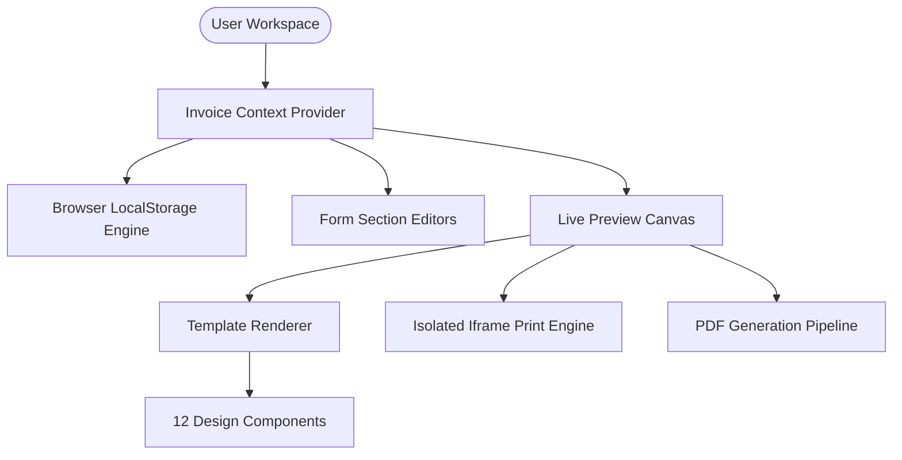

# Smart Invoice Builder v3.0

> **A fast, privacy-first, local-first invoice generation application built with React 18, TypeScript, and Vite.**

🌐 **Live Demo**: [https://smart-invoice-builder-free.vercel.app/](https://smart-invoice-builder-free.vercel.app/)

[](https://smart-invoice-builder-free.vercel.app/)
[](https://github.com/Najeeb1106/Smart-Invoice-Builder)
[](LICENSE)
[](https://www.typescriptlang.org/)
[](https://reactjs.org/)

---

## 📌 Executive Overview

**Smart Invoice Builder** is a modern, high-density web application designed for freelancers, agencies, consultants, retailers, and enterprise service providers to create, customize, and export professional A4 invoices instantly.

Built with a **local-first privacy architecture**, all user data and company assets remain securely stored inside the user's browser `localStorage`. No server tracking, third-party database dependencies, or account registration required.

---

## ✨ Key Features & Capabilities

- 🎨 **12 Distinct Invoice Templates**: Designed for Corporate, Creative, Freelancer, Tech/IT, Retail, and Consulting industries.
- 🔄 **5-Second Auto-Playing Carousel**: Landing page showcase carousel with real-time countdown timer bars and hover-pause functionality.
- ⚡ **Instant Calculation Engine**: Real-time financial calculations (Subtotal, Item Totals, Discount %, Taxable Base, Tax %, and Grand Total).
- 🖨️ **Fail-Proof Iframe Print Engine**: Isolated print pipeline bypassing Chrome media query bugs to generate crisp 1-page A4 printouts.
- 📄 **High-Resolution PDF Export**: Single and multi-page A4 PDF generation powered by `html2pdf.js` & `html2canvas`.
- 🔒 **Sequential Section Unlocking**: Step-by-step form validation locking downstream steps until required business details are provided.
- 📱 **Zero-Scroll Laptop Density**: Form layout, navbar (`44px`), and live preview paper canvas (`0.58` scale) optimized for 1366x768 / 1440x900 screens.
- 🖼️ **Client-Side Image Compression**: WebP logo compression algorithm preventing browser memory bloat.

---

## 🛠️ Architecture & Tech Stack



### Core Technologies
- **Frontend Core**: React 18 (App Router & Context API), TypeScript 5.5
- **Build System & Tooling**: Vite 5.4, ESBuild
- **Styling Architecture**: Pure Modular Vanilla CSS with CSS Custom Properties (`tokens.css`, `global.css`, `builder.css`, `templates.css`)
- **Icons**: Lucide React
- **PDF & Export**: `html2pdf.js`, `html2canvas`, `DOMPurify`
- **Testing**: Vitest 2.1

---

## 📁 Repository Structure

```
Smart-Invoice-Builder/
├── .github/
│   └── workflows/
│       └── ci.yml               # GitHub Actions CI pipeline
├── src/
│   ├── components/
│   │   ├── builder/             # Form section editors & sidebars
│   │   ├── common/              # Button, Input, Select, Textarea, Modal
│   │   ├── gallery/             # Template cards & auto-playing carousel
│   │   ├── layout/              # Navbar (44px) & Footer
│   │   └── templates/           # 12 Template design components
│   ├── data/                    # Template metadata & default invoice state
│   ├── pages/                   # Landing, Marketplace, Builder, Features, About, Contact
│   ├── services/                # Print, PDF, and Storage services
│   ├── state/                   # Invoice Context Provider & calculations
│   ├── styles/                  # tokens.css, global.css, builder.css, templates.css
│   ├── tests/                   # Vitest unit test suite
│   ├── types/                   # TypeScript interfaces
│   └── utils/                   # Financial calculation engine & formatters
├── .env.example                 # Environment configuration template
├── .gitignore                   # Git exclusion rules
├── CHANGELOG.md                 # Version history & release notes
├── CONTRIBUTING.md              # Contribution guidelines
├── LICENSE                      # MIT Open Source License
├── package.json                 # Dependency manifest
├── tsconfig.json                # TypeScript configuration
├── vite.config.ts               # Vite configuration
└── vitest.config.ts             # Vitest test runner configuration
```

---

## 🚀 Quickstart & Setup

### Prerequisites
- **Node.js**: `v18.0.0` or higher
- **npm**: `v9.0.0` or higher

### Installation

1. **Clone the Repository**:
   ```bash
   git clone https://github.com/Najeeb1106/Smart-Invoice-Builder.git
   cd Smart-Invoice-Builder
   ```

2. **Install Dependencies**:
   ```bash
   npm install
   ```

3. **Start Local Development Server**:
   ```bash
   npm run dev
   ```
   Open **`http://localhost:3000`** in your browser.

---

## 🧪 Testing & Verification

Run the automated Vitest test suite covering financial calculations, discounts, tax rates, and currency formatting:

```bash
npx vitest run
```

Run production build verification:

```bash
npm run build
```

---

## 📜 License

This project is open-source and released under the [MIT License](LICENSE).

---

## 👤 Author

Developed by **Najeeb Tahir**  
GitHub: [@Najeeb1106](https://github.com/Najeeb1106)
